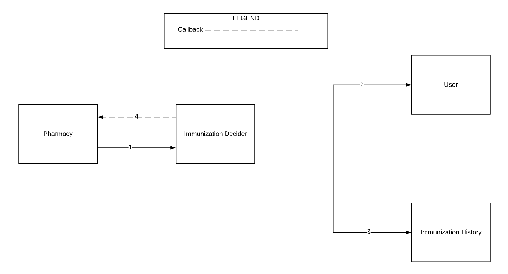
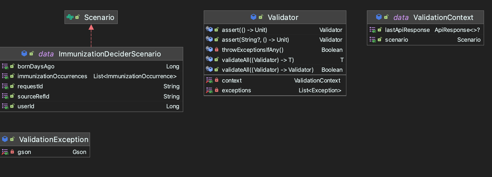

# Introduction

In micro-service architecture, multiple services integrate together to execute the workflows of user journeys. These
services are separated by concern instead of clumped into a single large monolith. With this separation, this provides
testing opportunity to test each service in isolation instead of just testing from the front end user perspective.

From a unit testing perspective, well-designed applications separate each class by responsibility and use dependency
injection. By doing so, all dependencies are mockable, allowing for near 100% code coverage in the unit tests.
Similarly, micro-services separated by responsibility allow for integration testing at the service level. Similar to
how [Mockito](https://site.mockito.org/), [MOQ](https://github.com/moq/moq4), and [MockK](https://mockk.io/) provide
mocking features at the class level for unit tests, Fake Dependency Service provides mocking features at the service
level for integration tests.

Fake Dependency Service is built with Spring Boot and Kotlin. It provides functionality to dynamically mock any RESTful
or SOAP API. To show how this service can be used, this repository contains an example micro-service (called
Immunization Decider Service) with example integration specs utilizing Fake Dependency Service for mocks.

## Contents

* [How to Start All Services in Docker and Run Tests](#how-to-start-all-services-in-docker-and-run-tests)
* [Fake Dependency Service](#fake-dependency-service)
* [Example Service Under Test - Immunization Decider Service](#example-service-under-test---immunization-decider-service)
* [Examples of Using Fake Dependency Service](#examples-of-using-fake-dependency-service)
* [Http Client Library](#http-client-library)
* [Example Integration Specs](#example-integration-specs)

## How to Start All Services in Docker and Run Tests

In order to run the services locally, [Docker Desktop](https://www.docker.com/get-started) must be installed. For Unix
based systems, we have various `.sh` files to up the services and start the tests. For Windows, the commands in
the `.sh` files should be identical to run in CMD or `.bat` files. These files are:

* [upExampleService.sh](./upExampleService.sh) - Ups the example service under test and Fake Dependency Service. Refer
  to [Docker Compose](./example-service-under-test/docker-compose.yaml) to see how both Fake Dependency Service and
  Immunization Decider Service run together.
* [downExampleService.sh](./downExampleService.sh) - Downs the example service under test and Fake Dependency Service.
* [runTestsLocal.sh](./runTestsLocal.sh) - Runs all unit tests and integration specs on `http://localhost`
* [runTestsCharles.sh](./runTestsCharles.sh) - Runs all unit tests and integration specs
  on `http://localhost.charlesproxy.com`. To see all requests and responses from the specs, it is recommended to
  download and install [Charles Proxy](https://www.charlesproxy.com/). Other proxy tools exist as well such
  as [Proxyman](https://proxyman.io/), but the config will need to be updated to hit the Proxyman proxy.
* Specs can also be run within IntelliJ. Open any spec file in
  the [Specs Directory](./example-service-under-test/src/test/groovy/co/tala/example/specs/immunization_decider). The
  default environment is `local`, so to update it to use Charles Proxy:
    * Open
      file [Configuration](./example-service-under-test/src/test/groovy/co/tala/example/specs/config/Configuration.groovy)
    * At ```System.properties.getProperty("environment") ?: "local"```, update `local` to `charles`.

## Fake Dependency Service

### Features

The mocking framework provides RESTful API endpoints to dynamically mock any RESTful or SOAP API. Example requests will
follow the descriptions further in the article. The features are:

* Setup Mock: This sets up a mock resource to return a json response body with response headers, and an http status
  code. It also allows us to set a delay in case we want to mock a slow api. A mock can be set to have a chain of
  responses, where the response changes based on the number of times it was called. For example, we can have a mock
  return 500 on call 1 followed by 200 on calls 2..n.
* Patch Mock: Since the setup mock only allows for mocking a json response, we can use the Patch Mock to update the
  response body to be any content. This can be XML String for SOAP or binary for files.
* Execute Mock: When the URI specified in the Setup is hit, it will return the mocked response body, response headers,
  and http status code. The request payload is captured and stored in Redis.
* Verify Mock: Returns the request payloads sent to the mock. There are 3 options defined by the `verifyMockContent`
  query param for the kind of verification to be returned. These features are explained
  under [Verification Features](#verification-features).
* The Setup, Patch, and Verify endpoints are hit when the URI contains `mock-resources` in it. Mapped by Http method,
  POST -> Setup, PATCH -> Patch, GET -> Verify. The same URI without `mock-resources` in it will then hit Execute. Any
  Http method is allowed.

### Making a Mock with a Unique Resource Id

Fake Dependency Service uses Redis to store the mock data. The key used for Redis lookup must be unique in order to
guarantee tests running in parallel do not override each other's mocks. Here are the parts that make up the unique key:

* The URI: The entire uri is part of the key. When unique resources exist in the URI, that is enough for the key to be
  unique. An example could be if a user's id is in the URI. Query Params can also provide unique resources in the URI.
* Request ID Headers: While optional, it is recommended to have a Request ID header for optimum uniqueness and
  performance. In micro-service architectures, it is a good practice for each service to forward Request IDs to each
  other. This allows for tracing of each workflow execution. Additionally, some URIs may not unique. A Request ID as
  part of the mock key will guarantee uniqueness. It is also recommended for performance when the URI (excluding query
  params) is not unique. This service allows multiple request headers to be used and the header names are configurable
  in [application.properties](./fake-dependency-service/src/main/resources/application.properties)
  at `config.request.id.headers`. The value is a comma delimited string of the request header names.
* If Request IDs are not used, we can grab a unique resource from the request payload sent to the mock as well, but this
  is not recommended for performance. The setup method can specify a path to a unique resource in the payload given that
  that resource is deterministic.

## Example Service Under Test - Immunization Decider Service

In this project, we have an example implementation of a micro-service that depends on various other services to gather
data for its business logic. It's called `Immunization Decider Service`. Its business domain to decide what
immunizations a user is eligible to receive. Immunization Decider Service does not store any data in its database about
the user or their immunization history, so it requests that information from User Service and Immunization History
Service. Based on the user's age and prior immunization history, it will decide what immunizations are available. The
rules for eligibility factor in the user's age and how long ago the user received any immunizations. The immunizations
this service knows about are: `COVID19`, `INFLUENZA`, and `TDAP`. The configuration for the rules is hardcoded
at [ImmunizationTypeResolver.kt](./example-service-under-test/src/main/kotlin/co/tala/example/api/immunization_decider/business/resolver/ImmunizationTypeResolver.kt)
.

Each immunization type requires:

* A minimum age.
* Minimum number of days between injection dosages, if they require more than one shot.
* Minumum number of days to receive the immunization again after it expires.

**Immunization Decider Flow**



Immunization Decider Service depends on three other services:

* Pharmacy Service
* User Service
* Immunization History Service

In order to test Immunization Decider Service, we need to mock all three dependent services using Fake Dependency
Service.

Here is the flow:

* Pharmacy Service requests Immunization Decider to make a decision for a user. Immunization Decider Service returns a
  202 immediately since the operation is async.
* Immunization Decider Service requests User Service for the user's profile, which contains their age.
* Immunization Decider Service requests Immunization History for the user, which contains all prior immunization
  administrations with timestamps.
* Immunization Decider Service will make a decision, log the result in the db, and send a callback to Pharmacy Service
  with the result.

**NOTE:** To simplify this example service, some key standard practices are not included:

* Authorization. This service does not require authorization for use.
* Pub / Sub (i.e Kafka). Instead of using Kafka to drive different stages of the workflow, the service just spawns the
  async processing on a separate thread. TODO: This example may be updated in the future to show how to use Kafka for
  pub/sub.

**It is important for real applications to follow these best practices for security and performance.**

## Examples of Using Fake Dependency Service:

**NOTES:**

* X-Request-ID is optional for services that use request ids and is configurable in application.properties
* Most headers are removed from the examples for compaction.
* These examples are taken from spec runs of the [Example Integration Specs](#example-integration-specs).

**Sections:**

* [Mock for request without payload with unique URI](#mock-for-request-without-payload-with-unique-uri)
* [Mock for request without payload with unique URI in Query Params](#mock-for-request-without-payload-with-unique-uri-in-query-params)
* [Mock for request with payload. URI is not unique. The mock id is retrieved from the request payload.](#mock-for-request-with-payload-uri-is-not-unique-the-mock-id-is-retrieved-from-the-request-payload)
* [Verification Features](#verification-features)

### Mock for request without payload with unique URI

In this example, we are mocking a User Service. The userId is in the URI, so that provides a unique mock id for the
test.

#### Setup

The integration tests hit this endpoint for the mock setup. Note that the URI contains `mock-resources`.

```http request
POST /mock-service/user-service/mock-resources/users/6887651168987276474 HTTP/1.1
X-Request-ID: 44968183-1f16-4482-a271-48cb02f44bf6

{"responseBody":{"userId":6887651168987276474,"dateOfBirth":"2021-09-26T17:00:48.662053Z","firstName":"f7181f4f4d2f4cd79f14a2982aa782f8","lastName":"295b65ec11d44acf8e7ae265c816c39f"},"responseSetUpMetadata":{"httpStatus":200,"delayMs":0}}

HTTP/1.1 200
{"responseBody":{"userId":6887651168987276474,"dateOfBirth":"2021-09-26T17:00:48.662053Z","firstName":"f7181f4f4d2f4cd79f14a2982aa782f8","lastName":"295b65ec11d44acf8e7ae265c816c39f"},"responseSetUpMetadata":{"httpStatus":200,"delayMs":0}}
```

The object of property `responseBody` tells the mock what data to return when the mock is hit. Inside
of `responseSetUpMetadata`, we have some options:

* `delayMs` : How long should the service pause for before returning the mocked response. This could be useful when
  testing integration with slow apis.
* `httpStatus`: What http response status code should be returned

#### Execute

The service under test hits this endpoint for its business logic. Note that the URI does not contain `mock-resources`.

```http request
GET /mock-service/user-service/users/6887651168987276474 HTTP/1.1
X-Request-ID: 44968183-1f16-4482-a271-48cb02f44bf6

HTTP/1.1 200
{"userId":6887651168987276474,"dateOfBirth":"2021-09-26T17:00:48.662053Z","firstName":"f7181f4f4d2f4cd79f14a2982aa782f8","lastName":"295b65ec11d44acf8e7ae265c816c39f"}
```

#### Verify

The integration tests hit this endpoint to verify all request payloads send to the mock. It returns a list of Strings.
In this example, it was a GET call, so there is no request payload.

```http request
GET /mock-service/user-service/mock-resources/users/6887651168987276474 HTTP/1.1
X-Request-ID: 44968183-1f16-4482-a271-48cb02f44bf6

HTTP/1.1 200 
[""]
```

#### Patch

For examples of Patch, see [SOAP.http](./http/SOAP.http).

### Mock for request without payload with unique URI in Query Params

In this example, we are mocking an Immunization History Service. The userId is in the query params of the URI, so that
provides a unique mock id for the test.

#### Setup

```http request
POST /mock-service/immunization-history-service/mock-resources/immunizations?userId=1058939979370581218 HTTP/1.1
X-Request-ID: 0a440da1-2fd3-49f8-be4c-7f9f5d516241
{"responseBody":{"occurrences":[{"date":"2020-08-22T17:00:48.352624Z","type":"INFLUENZA"}]},"responseSetUpMetadata":{"httpStatus":200,"delayMs":0}}

HTTP/1.1 200 
{"responseBody":{"occurrences":[{"date":"2020-08-22T17:00:48.352624Z","type":"INFLUENZA"}]},"responseSetUpMetadata":{"httpStatus":200,"delayMs":0}}
```

#### Execute

```http request
GET /mock-service/immunization-history-service/immunizations?userId=1058939979370581218 HTTP/1.1
X-Request-ID: 0a440da1-2fd3-49f8-be4c-7f9f5d516241

HTTP/1.1 200 
{"occurrences":[{"date":"2020-08-22T17:00:48.352624Z","type":"INFLUENZA"}]}
```

#### Verify

```http request
GET /mock-service/immunization-history-service/mock-resources/immunizations?userId=1058939979370581218 HTTP/1.1
X-Request-ID: 0a440da1-2fd3-49f8-be4c-7f9f5d516241

HTTP/1.1 200 
[""]
```

### Mock for request with payload. URI is not unique. The mock id is retrieved from the request payload.

In this example, we are mocking a Pharmacy Service, which is expecting a callback. The URI is static with no resources
in it, so the mock id is retrieved from the request payload. The setup uses query params to specify the path of property
in the payload. More examples can be found in [DeepPayload.http](./http/DeepPayload.http).

#### Setup

```http request
POST /mock-service/pharmacy-service/mock-resources/immunizations/decisions?sourceRefId=638e1cec-e0a6-48b3-a4c6-7ac21ef31973 HTTP/1.1
X-Request-ID: b8f1df1d-3397-4dba-9680-ecf1948d9808
{"responseBody":{},"responseSetUpMetadata":{"httpStatus":200,"delayMs":0}}

HTTP/1.1 200 
{"responseBody":{},"responseSetUpMetadata":{"httpStatus":200,"delayMs":0}}
```

The sourceRefId is an expected property of the request payload to the mock. The mock id will use this value for
uniqueness. Since this is a callback endpoint, it doesn't need to return a response payload.

#### Execute

```http request
POST /mock-service/pharmacy-service/immunizations/decisions HTTP/1.1
X-Request-ID: b8f1df1d-3397-4dba-9680-ecf1948d9808

{"sourceRefId":"638e1cec-e0a6-48b3-a4c6-7ac21ef31973","userId":5345095103772246863,"status":"SUCCESS","availableImmunizations":["TDAP"],"startedAt":"2022-01-04T17:00:53.000000Z","finishedAt":"2022-01-04T17:00:53.000000Z"}

HTTP/1.1 200 
{}
```

Since the `sourceRefId` in the request payload matches the query param in the setup, the mock is hit successfully. The
request payload is then stored in Redis for the verification endpoint.

#### Verify

```http request
GET /mock-service/pharmacy-service/mock-resources/immunizations/decisions?sourceRefId=638e1cec-e0a6-48b3-a4c6-7ac21ef31973 HTTP/1.1
X-Request-ID: b8f1df1d-3397-4dba-9680-ecf1948d9808

HTTP/1.1 200 
[{"sourceRefId":"638e1cec-e0a6-48b3-a4c6-7ac21ef31973","userId":5345095103772246863,"status":"SUCCESS","availableImmunizations":["TDAP"],"startedAt":"2022-01-04T17:00:53.000000Z","finishedAt":"2022-01-04T17:00:53.000000Z"}]
```

Since a request payload was sent to the mock, the Verify endpoint returns its payload. This allows integration tests to
verify all properties in request payload, similar to how unit testing frameworks allow assertions on params sent to
mocked methods.

### Verification Features

There are 3 different flavors for verification: `list`, `detailed`, and `last`. The `verifyMockContent` query param
defines which feature to use:

`verifyMockContent=list`

Returns a list of strings representing all request payloads to the mock. The `verifyMockContent` query param defaults to
this feature if not specified.

```http request
GET /mock-service/pharmacy-service/mock-resources/immunizations/decisions?sourceRefId=1f148c02-3530-40a4-9e87-14c0cfe71749&verifyMockContent=list
X-Request-ID: 5ee3f345-a882-4bf0-9ebc-fc9e7b5ccff4

HTTP/1.1 200
[{"sourceRefId":"1f148c02-3530-40a4-9e87-14c0cfe71749","userId":8793823052148616938,"status":"SUCCESS","availableImmunizations":[],"startedAt":"2022-03-01T17:00:55.000000Z","finishedAt":"2022-03-01T17:00:55.000000Z"}]
```

`verifyMockContent=detailed`

Returns
a [data structure](./fake-dependency-service/src/main/kotlin/co/tala/api/fakedependency/model/DetailedRequestPayloads.kt)
that has the count of requests, as well as the string representation of each request and a multi value map of its
request headers.

```http request
GET /mock-service/pharmacy-service/mock-resources/immunizations/decisions?sourceRefId=1f148c02-3530-40a4-9e87-14c0cfe71749&verifyMockContent=detailed
X-Request-ID: 5ee3f345-a882-4bf0-9ebc-fc9e7b5ccff4

HTTP/1.1 200
{"count":1,"requests":[{"payload":{"sourceRefId":"1f148c02-3530-40a4-9e87-14c0cfe71749","userId":8793823052148616938,"status":"SUCCESS","availableImmunizations":[],"startedAt":"2022-03-01T17:00:55.000000Z","finishedAt":"2022-03-01T17:00:55.000000Z"},"headers":{"x-request-id":["5ee3f345-a882-4bf0-9ebc-fc9e7b5ccff4"],"content-type":["application/json"],"content-length":["215"],"host":["fake-dependency-service:8099"],"connection":["Keep-Alive"],"accept-encoding":["gzip"],"user-agent":["okhttp/4.9.0"]}}]} 
```

`verifyMockContent=last`

Returns a binary of the last request to the mock. If the service under test were to upload a file to the mock, we can
use this to download the file

```http request
GET /mock-service/pharmacy-service/mock-resources/immunizations/decisions?sourceRefId=1f148c02-3530-40a4-9e87-14c0cfe71749&verifyMockContent=last
X-Request-ID: 5ee3f345-a882-4bf0-9ebc-fc9e7b5ccff4

HTTP/1.1 200
{"sourceRefId":"1f148c02-3530-40a4-9e87-14c0cfe71749","userId":8793823052148616938,"status":"SUCCESS","availableImmunizations":[],"startedAt":"2022-03-01T17:00:55.000000Z","finishedAt":"2022-03-01T17:00:55.000000Z"} 
```

## More Examples of Creating and Executing Mocks with HTTP Files

There are various examples of REST and SOAP mocks that can be executed at the [http](./http) directory. Start Fake
Dependency Service in docker, then run these files to see the service working in action.

* [ChainedResponses](./http/ChainedResponses.http) - Provides examples of chaining mock responses to return different
  responses when called multiple times.
* [DeepPayload](./http/DeepPayload.http) - Provides examples of where the unique id is a deeply nested property in a
  request payload.
* [DefaultMocks](./http/DefaultMocks.http) - Provides examples of default mock responses
* [GetWithQueryParam](./http/GetWithQueryParam.http) - Provides examples where the query param is the unique id
* [GetWithQueryParamMulti](./http/GetWithQueryParamMulti.http) - Provides examples where the query param is the unique
  id, and there are multiple query params.
* [GetWithUniqueURI](./http/GetWithUniqueURI.http) - Provides examples where the URI is unique enough
* [PostWithPayloadId](./http/PostWithPayloadId.http) - Provides examples where the unique is a root level property in a
  request payload.
* [ResponseHeaders](./http/ResponseHeaders.http) - Provides examples where the mock returns defined response headers.
* [SOAP](./http/SOAP.http) - Provides examples of SOAP API mock.
* [VerifyMockContent](./http/VerifyMockContent.http) - Provides examples of the verification features.
* [XRequestId](./http/XRequestId.http) - Provides examples where the X-Request-ID header is used as the unique id.
* [XRequestIdNotIncluded](./http/XRequestIdNotIncluded.http) - Provides examples where the X-Request-ID header is not
  included in the setup, but it is passed to the mock. NOTE: While this does work, it is recommended to set up with the
  request header id if the service under test is passing it.

To execute any of these http files:

* Open any of the `.http` files
* Either one request can run at a time, or the entire file can be run. The requests will run sequentially.
* To run a single request, select the green play button next to any HTTP request example, then
  click `run with [select env]`. The environment file is located at [http-client.env.json](./http/http-client.env.json)
* To run all requests in the file, click `Run all requests in file`, then select the environment.

## Http Client Library

For both Integration Specs and Service implementations, http requests are made to all external services. Having contract
bases http client libraries are essential to provide easy http request execution. There are various libraries to make
raw http requests, but those alone are not enough. In fact, wrapping one of those libraries to make contract based
clients is a good strategy. When designing a client library, there are some key features to include:

* When a request is sent:
    * A data class object defining the request payload contract should be serialized to json.
    * The correct request headers should be added.
* When a response is received:
    * The raw json should be deserialized to a data class object defining the response body contract.
    * The returning object should be a data class that wraps the deserialized content as well as any helpful metadata
      such as: http status code, response headers, request uri for logging, request method for logging, and elapsed for
      performance metrics.


This project contains an example http client library showing this and uses it in both the integration specs and the
example service under test.

### Example Http Client

See [ExampleHttpClient](./example-service-under-test/src/main/kotlin/co/tala/example/http/client/core/ExampleHttpClient.kt)
for the source code example. This class wraps OkHttpClient for the http core library and Gson for json serialization. It
provides methods for the Http methods `post`, `patch`, `put`, `get`, and `delete`. The request uri, request body
content, and request headers are the parameters. This class does not handle authorization, because the auth token should
be in the request headers passed or in the request uri, depending on how the external service expects it. Of course, the
OkHttpClient is injected, so any way we want to initialize it can be done by a factory class, including its
authorization features.

### Business Client (Contract Based Client)

The business client (or contract based clients) wrap the `ExampleHttpClient` and define the contract. It defines the
data classes for request and response bodies, request headers, and uri. Let's take a look at the example
at [ImmunizationDeciderClient](./example-service-under-test/src/main/kotlin/co/tala/example/http/client/lib/service/immunization_decider/ImmunizationDeciderClient.kt)
, which is the client used to send http requests to the example service under test in this project. It
wraps [ExampleHttpClient](./example-service-under-test/src/main/kotlin/co/tala/example/http/client/core/ExampleHttpClient.kt)
, [RequestHeaderBuilder](./example-service-under-test/src/main/kotlin/co/tala/example/http/client/lib/builder/RequestHeaderBuilder.kt)
,
and [QueryParamBuilder](./example-service-under-test/src/main/kotlin/co/tala/example/http/client/lib/builder/QueryParamBuilder.kt)
. The RequestHeaderBuilder handles creating the `X-Request-ID`, authorization, as well as any other custom defined
headers. Since this example project does not use authorization, we won't have an implementation for
the [IAuthenticator](./example-service-under-test/src/main/kotlin/co/tala/example/http/client/lib/auth/IAuthenticator.kt)
interface, so the object will be null. If we do want to include authorization, we would just need to implement a class
of `IAuthenticator` and inject it into `RequestHeaderBuilder`. The `QueryParamBuilder` handles creating query params to
append to the uri.

We have two methods

```kotlin
interface IImmunizationDeciderClient {
    fun initiateDecision(request: InitiateImmunizationDecisionRequest): ApiResponse<Unit>
    fun getStatus(sourceRefId: String): ApiResponse<ImmunizationDecisionStatusResponse>
}
```

The code to implement these methods is quite simple

```kotlin
class ImmunizationDeciderClient(
    private val client: IExampleHttpClient,
    private val requestHeaderBuilder: IRequestHeaderBuilder,
    private val queryParamBuilder: IQueryParamBuilder
) : IImmunizationDeciderClient {
    override fun initiateDecision(request: InitiateImmunizationDecisionRequest): ApiResponse<Unit> = client.post(
        uri = "/decisions",
        headers = requestHeaderBuilder.clear().build(),
        content = request
    ).apiResponse()

    override fun getStatus(sourceRefId: String): ApiResponse<ImmunizationDecisionStatusResponse> = client.get(
        uri = "/decisions${queryParamBuilder.clear().addParam("sourceRefId", sourceRefId).build()}",
        headers = requestHeaderBuilder.clear().build()
    ).apiResponse()
}
```

The serialization of `InitiateImmunizationDecisionRequest` happens at the `ExampleHttpClient` layer. The response coming
back is a [RawResponse](./example-service-under-test/src/main/kotlin/co/tala/example/http/client/core/RawResponse.kt),
which wraps the gson serializer, the Ok Http Client response object, and start and end timestamps. The deserialization
occurs by calling

```kotlin
inline fun <reified T : Any> RawResponse.apiResponse(): ApiResponse<T>
```

By using Kotlin's ```inline fun <reified T : Any>``` feature, it knows the class type for the response object and sends
that to the gson deserializer. More about Kotlin's reified type parameters can be
read [here](https://kotlinlang.org/docs/inline-functions.html#reified-type-parameters)

## Example Integration Specs

When designing integration specs, there are some key concepts that we want to design with:

* Keep the BDD layer (Spec layer) as thin as possible. This is done by creating a class with methods to execute each
  step of the workflow. This provides reusable code so that we can write many tests without duplicating code.
* When tests fail, we should print as much detail logging to troubleshoot why the test failed. This can include:
    * Key resources of the test such as userId, sourceRefId, X-Request-ID, seed data.
    * The last api response.
    * The names of the properties that caused the assertion exception.

Incorporating these strategies into integration specs is known as Step Provider Pattern and the classes involved are
described in the UML below.




A [WorkfloStepProvider](./example-service-under-test/src/main/kotlin/co/tala/example/specs/core/workflo/WorkfloStepProvider.kt)
is a class that provides all the steps in the workflow in any spec. This includes the setup, invocation of the service
under test, and all assertions. These methods are called in the `given`, `when`, and `then` of the BDD layer of the
spec. The `WorkfloStepProvider` keeps a reference to
the [Scenario](./example-service-under-test/src/main/kotlin/co/tala/example/specs/core/workflo/Scenario.kt). The
scenario encapsulates all data for the context of the test execution. This data should be different for each test
execution. Any resource that should be unique per execution, such as `userId`, `requestId`, and `sourceRefId` should be
randomized to avoid test collisions. When any test fails, the `Scenario` is printed. For our example project, the
Scenario
is [ImmunizationDeciderScenario](./example-service-under-test/src/main/kotlin/co/tala/example/specs/immunization_decider/ImmunizationDeciderScenario.kt)
. The `WorkfloStepProvider` gives us assertion capabilities. We can call `verify` and pass a lambda to make the
assertions. If we are testing a condition that will be met after an unknown time has passed, we can assert until the
condition is true using `verifyUntil`.

For the example project, we
created [ImmunizationDeciderProvider](./example-service-under-test/src/main/kotlin/co/tala/example/specs/immunization_decider/ImmunizationDeciderProvider.kt)
, which extends `WorkfloStepProvider`. It depends
on [ImmunizationDeciderScenario](./example-service-under-test/src/main/kotlin/co/tala/example/specs/immunization_decider/ImmunizationDeciderScenario.kt)
for its scenario
and [ImmunizationDeciderClientContainer](./example-service-under-test/src/main/kotlin/co/tala/example/specs/immunization_decider/ImmunizationDeciderClientContainer.kt)
, which encapsulates all the Business Http Clients. It contains all of the `given`, `when`, and `then` steps for our
specs.

Let's take a look at some examples of the provider methods:

#### GIVEN

This method sets up the mock for Immunization History Service. The `userId` and `immunizationOccurrences` are
encapsulated in the `Scenario`, so we have a stable way of ensuring the client is sending the correct data for the test.
How the Scenario gets initialized with our expected data will be explained under the provider factory section.
The `WorkfloStepProvider` has a `httpStatusShouldBe`, so that the test fails if the http status code is not correct.

```kotlin
fun setUpGetHistory(httpStatus: Int): ApiResponse<MockData<ImmunizationHistoryResponse>> =
    client.mockImmunizationHistory.setUpGetHistory(
        userId = scenario.userId.toString(),
        request = mockData(
            responseBody = ImmunizationHistoryResponse(
                occurrences = scenario.immunizationOccurrences
            ),
            httpStatus = httpStatus
        )
    ).httpStatusShouldBe(200)
```

#### WHEN

This method executes the service under test to process the decision.

```kotlin
fun initiateDecision(): ApiResponse<Unit> = client.immunizationDecider.initiateDecision(
    request = InitiateImmunizationDecisionRequest(
        sourceRefId = scenario.sourceRefId,
        userId = scenario.userId.toString()
    )
).httpStatusShouldBe(202)
```

#### THEN

When we have a decision, we call this method to assert the `status` and `availableImmunizations` are correct.
In `verify`, we call `assert` for each assertion we want to make. The first param is a `hint`, so that if a test fails,
we know what failed. The second param is a lambda for the assertion.

```kotlin
fun verifyImmunizationDecisionStatus(
    response: ImmunizationDecisionStatusResponse?,
    expectedStatus: ImmunizationDecisionStatus,
    expectedAvailableImmunizations: List<ImmunizationType>
): Boolean {
    val actual = response.notNull("ImmunizationDecisionStatusResponse")
    return verify {
        assert("status") { actual.status shouldBe expectedStatus }
        assert("availableImmunizations") { actual.availableImmunizations?.sorted() shouldBe expectedAvailableImmunizations.sorted() }
        assert("userId") { actual.userId shouldBe scenario.userId }
        assert("sourceRefId") { actual.sourceRefId shouldBe scenario.sourceRefId }
    }
}
```

#### Provider Factory

In order to create a provider with the Scenario we need, we use
the [ImmunizationDeciderProviderFactory](./example-service-under-test/src/main/kotlin/co/tala/example/specs/immunization_decider/ImmunizationDeciderProviderFactory.kt)
and call

```kotlin
fun create(bornDaysAgo: Long, immunizationOccurrences: List<ImmunizationOccurrence>): ImmunizationDeciderProvider
```

Since `bornDaysAgo` and `immunizationOccurrences` are the test seed data, those should be passed in as they are
controlled by the spec layer. We use data driven sets to create various scenarios. All other parts of the scenario are
randomized.

The [ImmunizationDeciderProviderFactoryConfig](./example-service-under-test/src/main/kotlin/co/tala/example/specs/immunization_decider/ImmunizationDeciderProviderFactoryConfig.kt)
tells the factory what the base urls are for the http client so that the factory can initialize them. The Spec layer has
a reference to the factory. Each test execution calls the factory to create a unique `ImmunizationDeciderProvider` for
the test run. This ensures all unique resources are indeed unique per test execution.


#### Example Specs

Integration Specs for Immunization Decider Service can be found
at [InitiateDecisionSpec](./example-service-under-test/src/test/groovy/co/tala/example/specs/immunization_decider/InitiateDecisionSpec.groovy)
. We are using [Spock Framework](https://spockframework.org/spock/docs/2.0/index.html) for our specification framework.
It provides clean BDD functionality and the data driven sets are easy to compose. We are not using its assertion
framework since that is all handled by the workflo step providers. In fact, the spec layer itself is the only groovy
code. All the actual test code is in Kotlin.

Since we have a step provider, each execution step should map to a single method call to keep the BDD layer thin, which
is key to readable and reusable code. For example, this `given` will initialize the provider, and call it to mock the
user service.

```groovy
given: "user service is mocked to return 200"
    ImmunizationDeciderProvider provider = factory.create(bornDaysAgo, immunizationOccurrences)
    provider.setUpGetUser(200)
```

The next part of the workflow is to initiate the decision

```groovy
when: "an immunization decision is initiated"
    provider.initiateDecision()

and: "the decision completes"
    ImmunizationDecisionStatusResponse actualDecision = provider.getStatusUntilCompleted().body
```

Verify the behavior

```groovy
then: "the immunization status should be #expectedStatus"
and: "the immunizations available should be #expectedImmunizationsAvailable"
    provider.verifyImmunizationDecisionStatus(actualDecision, expectedStatus, expectedImmunizationsAvailable)
```

Use Data Driven Sets for various scenario combinations. Here we specify what the `bornDaysAgo`
and `immunizationOccurrences` are. The `expectedImmunizationsAvailable` is the expected outcome from decider's
evaluation.

```groovy
where:
    bornDaysAgo | immunizationOccurrences      | expectedImmunizationsAvailable
    // No Vaccination History
    100         | []                           | []
    400         | []                           | [INFLUENZA]
    365 * 11    | []                           | [INFLUENZA, TDAP]
    365 * 20    | []                           | [INFLUENZA, TDAP, COVID19]

    // Vaccination History
    400         | [occurrence(100, INFLUENZA)] | []
    800         | [occurrence(500, INFLUENZA)] | [INFLUENZA]
    365 * 11    | [occurrence(100, INFLUENZA)] | [TDAP]
    365 * 12    | [occurrence(500, INFLUENZA)] | [TDAP, INFLUENZA]
```

#### Example Assertion Failures

Specs that fail of purpose can be found
at [InitiateDecisionFailOnPurposeSpec](./example-service-under-test/src/test/groovy/co/tala/example/specs/immunization_decider/InitiateDecisionFailOnPurposeSpec.groovy)
.

We are utilizing [Kotest Assertion Library](https://kotest.io/docs/assertions/assertions.html). It has a vast assertion
library. When tests fail, the Exception will print our custom test context along with Kotest's assertion errors. We
print the following:

* The last api response (if there was one)
* The Scenario
* All assertion failures.

```text
co.tala.example.specs.core.validator.ValidationException: 
Validations Failed!
Test Context:
{
  "lastApiResponse": {
    "body": {
      "sourceRefId": "ac06c2bd-33ca-4e20-a9a7-ffcb756a220c",
      "userId": 8346885875081655184,
      "status": "SUCCESS",
      "availableImmunizations": [
        "TDAP"
      ],
      "startedAt": "2022-01-05T18:53:46.000Z",
      "finishedAt": "2022-01-05T18:53:47.000Z"
    },
    "statusCode": 200,
    "url": "http://localhost.charlesproxy.com:9000/immunization-decider/decisions?sourceRefId\u003dac06c2bd-33ca-4e20-a9a7-ffcb756a220c",
    "method": "GET",
    "isSuccessful": true,
    "elapsed": 8
  },
  "scenario": {
    "sourceRefId": "ac06c2bd-33ca-4e20-a9a7-ffcb756a220c",
    "userId": 8346885875081655184,
    "requestId": "d2a4961d-ceed-4540-8e80-5478adb752ca",
    "bornDaysAgo": 4015,
    "immunizationOccurrences": [
      {
        "date": "2021-09-27T18:53:45.111Z",
        "type": "INFLUENZA"
      }
    ]
  }
}
 
Assertion Failure 1
Assertion failed! Hint: 'availableImmunizations'
Element differ at index: [0]
Missing elements from index 1
expected:<[COVID19, TDAP]> but was:<[TDAP]>
```

_The stacktrace is also logged, but ommitted from this example._

Let's examine the assertion error part:

```text
Assertion Failure 1
Assertion failed! Hint: 'availableImmunizations'
Element differ at index: [0]
Missing elements from index 1
expected:<[COVID19, TDAP]> but was:<[TDAP]>
```

We provided a hint of `availableImmunizations`. The error from Kotest
was ```expected:<[COVID19, TDAP]> but was:<[TDAP]>```. This gives us enough information to know that
the `availableImmunizations` was wrong by showing the actual and expected values.

There can also be situations where multiple properties fail. We want to know all of them rather than just fail the test
immediately. Example:

```text
Assertion Failure 1
Assertion failed! Hint: 'number'
expected:<2> but was:<1>

Assertion Failure 2
Assertion failed! Hint: 'string'
expected:<"bar"> but was:<"foo">
```
